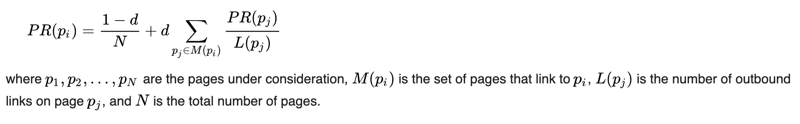

Hi Prof. Mowry and Prof. Railing,

Since our previous project idea are not interested enough during the discussion, here are two of our new ideas, and we would like to know if either looks good and we will have more details in our proposal.

Parallel wavelet transform:
Implement parallel wavelet compression. Wavelet transforms are one of the most popular time-frequency-transformations and are widely used for data compression, especially image compression; notable applications include JPEG 2000 and DjVu. For good resolution on high-frequency terms, the wavelet compression shows a better compression performance for images that have transient signals.

Challenges:
Workload Imbalance: Deepr decompositions have less data size, leading to imbalance between threads/processors.
Dynamic Data Movement: Especially in lifting schemes or multi-dimensional transforms, values may move between processors, and memory access can be irregular.
Synchronization Overhead: Multi-level transform has dependencies between levels. Barrier needed before moving to next level.
Data Dependency: Convolutions involve neighboring elements. This creates spatial dependencies, especially with large filters

Parallel PageRank Algorithm with streaming input:

To mock real time application, we plan to parallelize the pagerank algorithm with streaming input, which means after each iteration, some nodes will be added and dropped.

Challenges:
Workload Imbalance: Skewed degree distributions lead to uneven computation
Dynamic Data Movement: 	Cross-node rank updates require non-local access
Synchronization Overhead: Iteration barriers limit speedup
Data Dependency: PageRank at t+1 depends on in-links' values at t

The main computation task:
